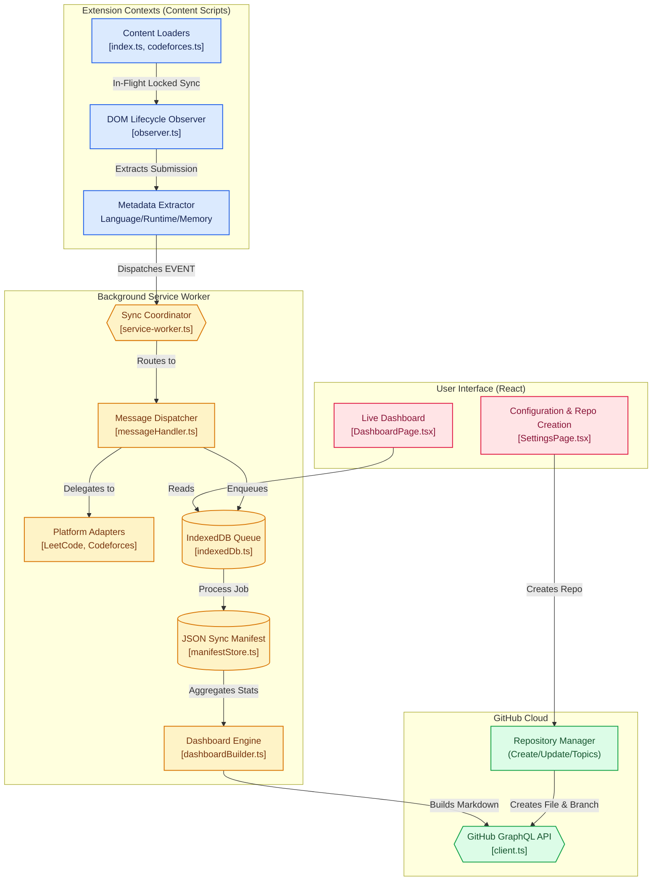

# AlgoVault v2 🚀

  

  <strong>The Ultimate Multi-Platform Competitive Programming Automation Engine</strong>

  
  
  
  
  

---

## 🌟 Overview

**AlgoVault v2** is a production-grade Chrome extension designed for software engineers and competitive programmers. It seamlessly synchronizes your **LeetCode** and **Codeforces** submissions to a dedicated GitHub repository, creating a professionally structured portfolio of your coding journey.

Unlike basic sync tools, AlgoVault is built with a **"Nuclear Stability"** architecture. It implements aggressive race-condition locking, zero-duplicate guards, and robust background sync loops, ensuring your data is always pristine even during rapid coding sessions or weak networks.

## 🚀 Key Features

- **🌐 Multi-Platform Support:** Seamlessly syncs solutions from both **LeetCode** and **Codeforces**, natively extracting runtime, memory, language, and problem metadata.
- **⚡ Instant Auto-Sync:** Automatically pushes your "Accepted" submissions to GitHub within 1 second. Fast DOM-locking guarantees that *only* Accepted solutions are pushed, with zero duplicates.
- **🔄 Cross-Device Synchronization:** Uses a Git-synced JSON manifest (`.algovault/manifest.json`) as the single source of truth. Your stats and dashboards sync instantly across all devices.
- **➕ In-App Repository Creation:** Create a brand new, SEO-optimized public GitHub repository (e.g., `algovault-solutions`) directly from the extension settings with a single click.
- **📊 Dynamic Master Dashboard:** AlgoVault automatically builds and continuously updates a `README.md` at the root of your repository. This recruiter-ready dashboard combines real-time SVG heatmaps and statistics for both platforms side-by-side.
- **📁 Professional Structuring:** Organizes your code automatically by `Platform > Topic > Problem Name > Language > solution.ext`.
- **🔐 Secure & Private:** Implements GitHub Device Flow or fast-web OAuth. Your GitHub tokens are strictly encrypted and stored locally on your device.

## 🏗️ Architecture & Data Flow

AlgoVault is built with a highly decoupled, modern extension architecture designed for resilience, modularity, and fast asynchronous processing.

## 🛠️ Quick Setup Guide

Get up and running with **AlgoVault v2** in less than 2 minutes:

### 1. Installation
1.  **Download:** Head over to the [Latest Releases](https://github.com/mr-sanjai-offl/AlgoVault/releases) and download the latest `.zip` file (e.g., `algovault-2.0.0.zip`).
2.  **Extract:** Unzip the downloaded file into a folder on your computer.
3.  **Load to Chrome:**
    - Open Chrome and navigate to `chrome://extensions/`.
    - Enable **Developer Mode** (toggle in the top-right corner).
    - Click **Load unpacked** and select the folder where you extracted the extension.

### 2. Authentication & Repository Creation
1.  **Connect GitHub:** Open the AlgoVault popup from your browser toolbar and click **Connect GitHub** to securely authorize the extension.
2.  **Create a Repository:** Once authenticated, go to the **Settings** tab. Click **Create New Repository**, enter a name (e.g. `algovault-solutions`), and click Create. It will instantly generate a public repository populated with SEO topics.
3.  *(Optional)* Or select an existing repository from the dropdown.

### 3. Start Syncing!
1.  Navigate to any problem on [LeetCode](https://leetcode.com/) or [Codeforces](https://codeforces.com/).
2.  Solve the problem and hit **Submit**.
3.  **Done!** Once your solution is **Accepted**, AlgoVault will instantly push your code to GitHub and update your Root Dashboard!

  

## 🛡️ Production-Grade Reliability

AlgoVault is built to handle the edge cases that break basic extensions:
- **Zero Duplicates:** A strict synchronous `inFlightSubmissionId` lock completely nullifies the risk of double-syncing caused by React DOM jitter.
- **Graceful Error Handling:** Uses a dedicated background mutex (`activeJobs`) to guarantee that asynchronous GitHub API pushes never collide or overwrite each other.
- **Atomic Operations:** Integrates GitHub GraphQL conflict resolution to ensure no submission is lost due to network lag.

---

  Built with ❤️ for the Developer Community

