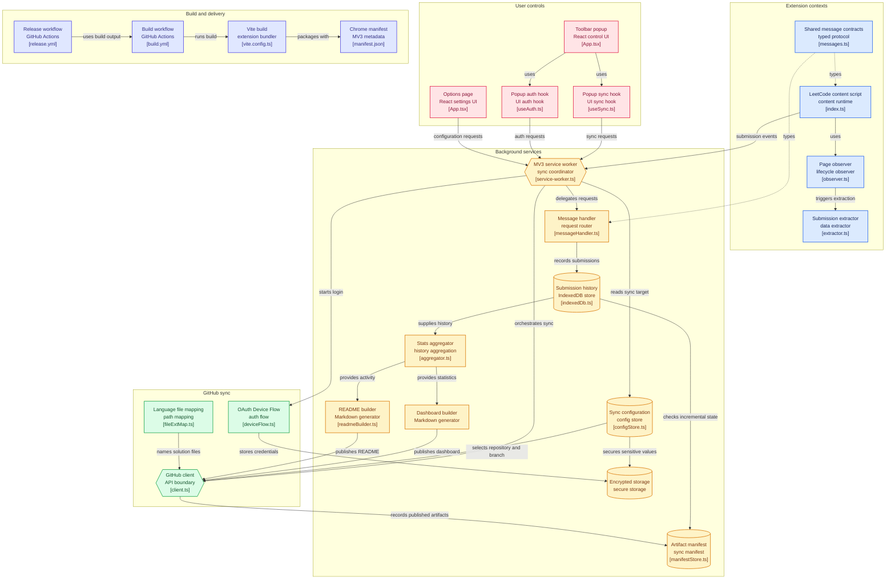
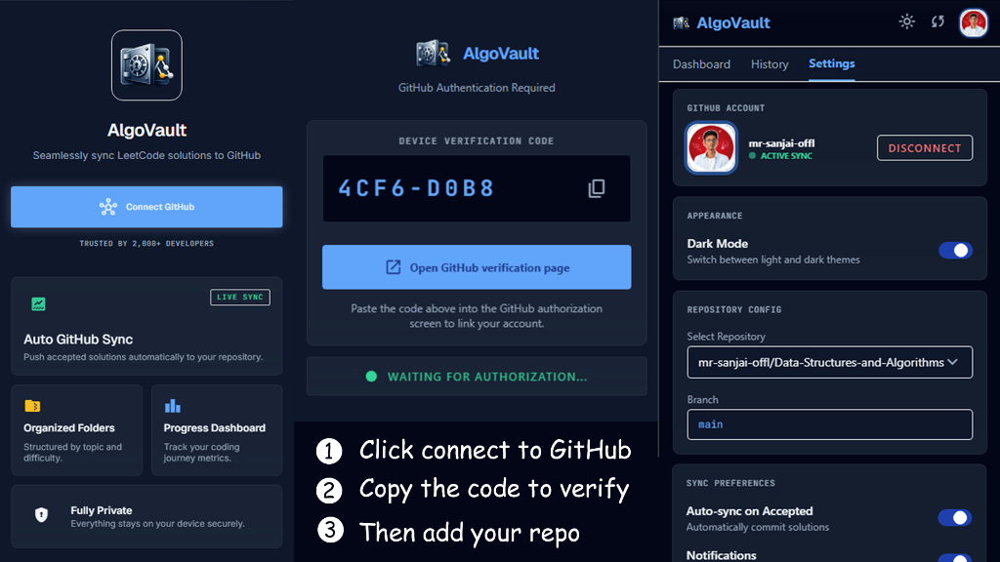

# AlgoVault 🚀

  

  <strong>The Ultimate LeetCode-to-GitHub Automation Engine</strong>

  
  
  
  
  

---

## 🌟 Overview

**AlgoVault** is a production-grade Chrome extension designed for software engineers who want to automate their coding journey. It seamlessly synchronizes your LeetCode submissions to a dedicated GitHub repository, creating a professionally structured portfolio of your problem-solving skills.

Unlike basic sync tools, AlgoVault is built with a **"Nuclear Stability"** architecture, ensuring it remains resilient during browser updates, extension reloads, and complex page lifecycles. It also boasts flawless **Cross-Device Synchronization** to ensure your data stays intact no matter where you code.

## 🚀 Key Features

- **⚡ Instant Auto-Sync:** Automatically pushes your "Accepted" submissions to GitHub within 1 second. Built-in verifications guarantee that *only* Accepted solutions are pushed—"Wrong Answer" or failed solutions are strictly ignored.
- **🔄 Cross-Device Synchronization:** Uses a Git-synced JSON manifest (`.algovault/manifest.json`) as the single source of truth. Your dashboard and problem stats instantly sync across all your devices (PC, laptop, etc.) without losing any historical data!
- **📁 Professional Structuring:** Organizes your code automatically by **Topic > Problem Name > Language > solution.ext**, giving your repository a clean and catchy look.
- **📊 Real-time Dashboard:** Generates and continuously updates a recruiter-friendly `README.md` in your repository root, complete with activity heatmaps and categorized problem lists.
- **🛡️ Nuclear Stability:** Hardened against "Extension context invalidated" errors using advanced zombie-state detection and defensive API wrappers.
- **🔐 Secure & Private:** Implements GitHub Device Flow for authentication. Your GitHub tokens are strictly encrypted and stored locally on your device.

## 🏗️ Architecture & Data Flow

AlgoVault is built with a highly decoupled, modern extension architecture designed for resilience and fast, asynchronous processing.

## 🛠️ Quick Setup Guide

Get up and running with **AlgoVault** in less than 2 minutes:

### 1. Installation
1.  **Download:** Head over to the [Latest Releases](https://github.com/mr-sanjai-offl/AlgoVault/releases) and download the latest `.zip` file (e.g., `algovault-v1.0.3.zip`).
2.  **Extract:** Unzip the downloaded file into a folder on your computer.
3.  **Load to Chrome:**
    - Open Chrome and navigate to `chrome://extensions/`.
    - Enable **Developer Mode** (toggle in the top-right corner).
    - Click **Load unpacked** and select the folder where you extracted the extension.

### 2. Authentication & Linking
1.  **Connect GitHub:** Open the AlgoVault popup from your browser toolbar and click **Connect GitHub**. 
2.  **Verify Device:** A verification code will appear. Click the link to open the GitHub activation page, paste the code, and authorize the extension.
3.  **Link Repository:** Once authenticated, go to the **Settings** tab in the extension popup. Select the repository and branch where you want your solutions stored.

### 3. Start Syncing
1.  Navigate to any problem on [LeetCode](https://leetcode.com/problemset/all/).
2.  Solve the problem and hit **Submit**.
3.  **Done!** Once your solution is **Accepted**, AlgoVault will instantly push your code to GitHub and update your repository dashboard automatically.

  

## 🛡️ Resilience & Reliability

AlgoVault is built to handle the "Edge Cases" that break other extensions:
- **Zero Duplicates:** Strict synchronous locking prevents duplicate commits even during rapid page refreshes.
- **Context Awareness:** Proactively detects when the extension has been updated and prompts the user to refresh, preventing silent failures.
- **Atomic Operations:** Uses a job queue system with exponential backoff and GraphQL conflict resolution to ensure no submission is ever lost due to network issues.
- **Permanent IDs & Session Persistence:** Cryptographically secured extension ID and persistent local storage ensure your token and settings survive version updates!

---

  Built with ❤️ for the Developer Community

